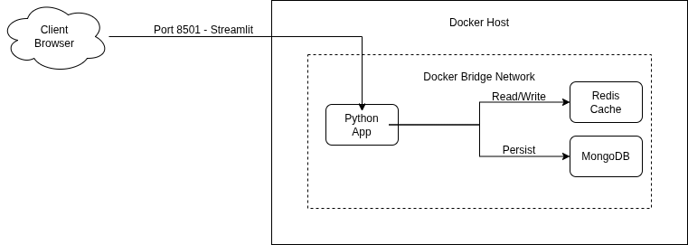
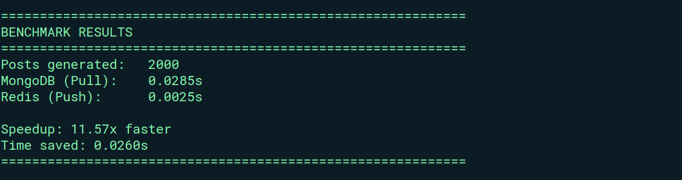
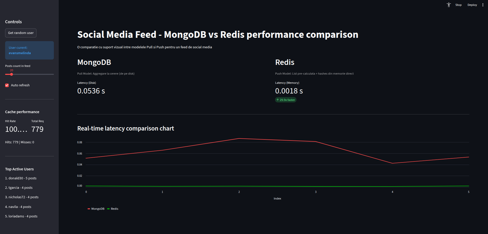

# Social Media Feed Engine: Arhitectura Redis si MongoDB

**Curs:** Baze de date, de la NoSql la Vector DBs   
**Tema:** T4 - Caching and data acceleration with Redis     
**Student:** Cosor Mihail   
**Grupa:** 343  

---

## 1. Rezumat introductiv
Acest proiect implementeaza un backend scalabil pentru social media, utilizand Redis ca strat de caching in-memory pentru a optimiza scenarii de tip Read-Heavy.
Solutia este un proof of concept care demonstreaza avantajele arhitecturii hibride (MongoDB + Redis) si a modelului "Fan-out on Write" (Push Model) pentru reducerea latentei in feed-urile utilizatorilor.
Prin implementarea acestui model am reusit sa obtinem un speedup de 11.57 pe un benchmark de 100 000 de useri cu 2000 de postari fiecare, avand intre 50 si 300 de urmaritori.

---

## 2. Arhitectura sistemului si specificatii tehnice

### 2.1 Configuratie Hardware si Retea
Sistemul este proiectat pe o arhitectura de tip microservices, folosind containere Docker pentru a simula un mediu de productie cu resurse limitate, dar in continuare realiste.

* **Host Environment:** Laptop x86_64 Architecture.
* **Virtualization Layer:** Docker Engine v24.
* **Retea:** Docker Bridge Network pentru comunicarea intre containere.
* **Containere:**
  - **Redis Container:** Stocare In-Memory pentru feed-uri.
  - **MongoDB Container:** Stocare persistenta pentru postari si useri.
  - **App Container:** Bussines logic(backend) si simulator de trafic.




### 2.2 Fluxul de date
Sistemul separa calea de scriere (Write Path) de cea de citire (Read Path):

1.  **Write Path (Complexitate O(K)):** Client -> App -> MongoDB (Persist) -> Redis Fan-out.
2.  **Read Path (Complexitate O(1)):** Client -> App -> Redis List (Fetch IDs) -> Redis Hash (Fetch Content) -> Return.

### 2.3 Stack Software
* **Limbaj:** Python 3.9 (Biblioteci: `redis-py`, `pymongo`, `streamlit`, `faker`).
* **Database:** MongoDB 6.0.
* **Cache:** Redis 7.0.
* **OS:** Linux Alpine (in containere) pentru a fi lightweight.

---

## 3. Implementare Tehnica

### 3.1 Strategia "Fan-out on Write" (Push Model)
Spre deosebire de interogarile clasice SQL/NoSQL care filtreaza datele la runtime (Pull Model), am implementat un model de tip Push, unde la momentul scrierii unei postari, aceasta este propagata instantaneu in feed-urile tuturor followerilor userului care a creat postarea.

**Cod Implementare (`src/backend.py`):**
```python
def create_post_redis(user_id, content, username):
    # cream obiectul post pentru redis
    post_data = {
        "id": str_post_id,
        "username": username,
        "content": content,
        "timestamp": str(datetime.utcnow())
    }

    # fan out: catre followeri 
    user = db.users.find_one({"_id": ObjectId(user_id)})
    followers = user.get("followers", [])
    
    pipe = cache.pipeline()
    
    # adaugam post in timeline-ul fiecarui follower
    for follower_id in followers:
        key = f"timeline:{follower_id}"
        pipe.lpush(key, str_post_id)
        # tinem doar last 100 posts
        pipe.ltrim(key, 0, 99)
    
    # update leaderboard
    pipe.zincrby("leaderboard:active_users", 1, username)
    
    pipe.execute()
    return post_id

```

### 3.2 Citirea rapida prin Redis(O(1))

Citirea feed-ului nu este o operatie time consuming, tot ce facem este sa preluam o lista din Redis (instant). Ulterior folosim desigur un pipeline pentru a prelua detaliile complete pentru fiecare postare.

**Cod Implementare:**

```python
def get_feed_redis(user_id, limit=10):
    start_time = time.time()
    
    post_ids = cache.lrange(f"timeline:{user_id}", 0, limit - 1)
    
    posts = []
    # luam datele din cache folosind pipeline pentru eficienta
    pipe = cache.pipeline()
    for pid in post_ids:
        pipe.hgetall(f"post:{pid}")
    
    results = pipe.execute()
    
    # procesam si tinem cont de hits/misses
            
    duration = time.time() - start_time
    return posts, duration

```

### 3.3 Utilizarea Sorted Sets pentru Analytics

Pentru a demonstra capabilitatile Redis, am implementat un leaderboard care tine evidenta utilizatorilor cei mai activi (cu cele mai multe postari).

**Snippet Leaderboard:**

```python
# adaugam post in timeline-ul fiecarui follower
for follower_id in followers:
    key = f"timeline:{follower_id}"
    pipe.lpush(key, str_post_id)
    # tinem doar last 100 posts
    pipe.ltrim(key, 0, 99)

# update leaderboard
pipe.zincrby("leaderboard:active_users", 1, username)

# mai tarziu, preluam
def get_leaderboard(top_n=5):
    # zrevrange va returna userii cu cele mai mari scoruri
    return cache.zrevrange("leaderboard:active_users", 0, top_n - 1, withscores=True)

```

### 3.4 Cache Eviction

Am configurat doua strategii de eviction pentru a gestiona memoria limitata a Redis:

1. **TTL (Time-To-Live):** 
```python
cache.expire(f"post:{str_post_id}", 3600)

```


2. **LRU (Least Recently Used):**
```yaml
command: ["redis-server", "--maxmemory", "100mb", "--maxmemory-policy", "allkeys-lru"]

```


---

## 4. Benchmark pentru latenta si scalabilitate

Testele au fost rulate folosind un simulator Python care genereaza trafic continuu (postari si citiri).

| Metrica | MongoDB (Disk-Based) | Redis (In-Memory) | Obs |
| --- | --- | --- | --- |
| **Latenta** | **~0.0285s** | **~0.0025 sec** | Redis este de **~11.57x mai rapid**. |
| **Scalabilitate** | Scade liniar cu nr. posts | Constanta (O(1)) | Redis nu este afectat de volumul de date cat timp incape in memorie. |




### Interpretarea Rezultatelor

Diferentaa de performanta este semnificativa, demonstrand avantajele arhitecturii hibride si a modelului Push pentru scenarii Read-Heavy. Acest fapt poate fi redus la comparatie dintre citirea de pe disc (MongoDB), care chiar si SSD are latente mai mari, si citirea din memorie (Redis), care este aproape instantanee.

---

## 5. Install and run

### Cerinte

* Docker
* Python 3.9+.

### Instalare Dependinte

```bash
# init .venv mai intai, eventual crearea lui daca nu exista
python3 -m venv .venv

# activare .venv
source .venv/bin/activate

# instalare dependinte
pip install -r requirements.txt

```

### Comenzi

```bash
# pornire containere
docker compose up -d

# generare date test
python src/seed.py

# pornire simulator de trafic
python src/simulator.py

# lansare dashboard
streamlit run src/dashboard.py

```

### Demo

#### Video Demo: https://drive.google.com/file/d/1pyaOWn9uBJPgezxCtf8dU-Had_0t0Ra2/view?usp=sharing

#### Screenshot Dashboard



---

## 6. Bibliografie

[1] Redis Docs: https://redis.io/docs/  
[2] MongoDB Manual, Aggregation Pipeline: https://www.mongodb.com/docs/manual/core/aggregation-pipeline/.   
[3] Gemini AI in scopul optimizarii eficientei scripturilor de `seed.py` si `test_benchmark.py`: https://gemini.google.com/.
